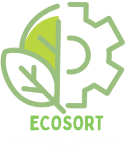

# EcoSort - Tri des déchets simplifié

## Sommaire

- [Introduction](#introduction)
- [Configuration requise](#configuration-requise)
- [Installation](#installation)
- [Lancer l'API](#lancer-lapi)
- [Lancer l'application mobile](#lancer-lapplication-mobile)
- [Utilisation](#utilisation)
- [Auteurs](#auteurs)

## Introduction

EcoSort est une application mobile qui simplifie le tri des déchets en utilisant la technologie YOLO (You Only Look Once) pour détecter le type de matériau d'un déchet en prenant une photo. Cette application est accompagnée d'une API Flask qui effectue la détection des objets à l'aide d'un modèle YOLOv7 pré-entraîné.



## Configuration requise

Avant de commencer, assurez-vous d'avoir les éléments suivants installés sur votre système :

- [Node.js](https://nodejs.org/) (pour l'application mobile)
- [Python 3.7](https://www.python.org/downloads/release/python-3100/) (pour l'API Flask)
- [Git](https://git-scm.com/) (pour cloner le projet depuis le référentiel Git)

## Installation

1. Clonez le référentiel Git sur votre ordinateur en utilisant la commande suivante :

```bash
git clone https://github.com/ddsmlf/EcoSort.git
```

2. Accédez au répertoire principal du projet :

```bash
cd EcoSort
```

3. Installez les dépendances Node.js pour l'application mobile en exécutant la commande suivante :

```bash
npm install
```

4. Installez les dépendances Python requises pour l'API Flask en utilisant `pip`. Assurez-vous d'utiliser Python 3.10 et exécutez la commande suivante depuis le répertoire `API` :

```bash
pip install -r requirements.txt
```


## Lancer l'API

1. Accédez au répertoire `API` :

```bash
cd API
```

2. Téléchargez le poids ONNX depuis [ce lien](https://drive.google.com/file/d/1qzvO49ij8cSnpNURjtUGdGALYr4nZUgH/view?usp=drive_link) et placez-le dans le répertoire `API` aux côtés de `app.py`.


3. Lancez l'API Flask en exécutant `app.py` :


```bash
python app.py
```


L'API sera maintenant en cours d'exécution à l'adresse [http://localhost:5000](http://localhost:5000).

## Lancer l'application mobile

1. Accédez au répertoire `App` :
```bash
cd ../App
```

2. Lancez l'application mobile en utilisant Expo avec la commande suivante :
```bash
npm start
```

3. Suivez les instructions pour lancer l'application sur un émulateur ou un appareil mobile physique à l'aide de l'application Expo Go.

## Utilisation

1. Lorsque l'application est en cours d'exécution, vous pouvez prendre une photo d'un déchet en utilisant l'appareil photo de votre appareil mobile.

2. L'application enverra automatiquement la photo à l'API Flask.

3. L'API effectuera la détection des matériaux et renverra la poubelle correspondante.

4. L'application affichera le résultat du tri, vous indiquant dans quelle poubelle jeter le déchet.


## Auteurs

- [AL BARAZI Farid](https://github.com/FaridAlBarazi)
- [BOISSON Anaïs](https://github.com/anaisboisson52)
- [FERNET Sebastien]()
- [LO PINTO Matéo](https://github.com/Matelop132)
- [REYNAUD Lucas](https://github.com/lucasbx33)
- [SAINT-MARC Victorien]()
- [COLIN Mélissa](https://github.com/ddsmlf)
- [AWASSUME Kinsy Nyahim]()
